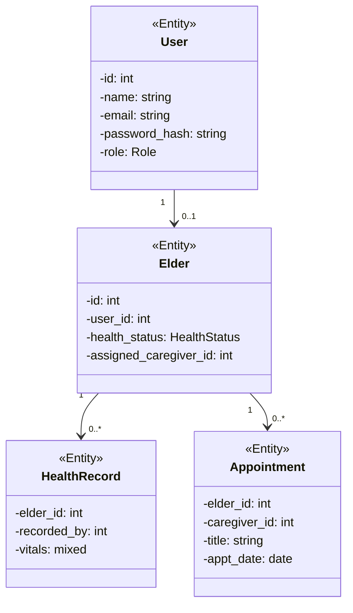

# Elder Care Management System

**Module:** IWT — Internet and Web Technologies  
**Technology Stack:** HTML, CSS, JavaScript, PHP, MySQL  
**Repository:** https://github.com/ashifahmed-924/IWT-Elderly-Care-Management-System  
**Student Name:** [Your Name]  
**Student ID:** [Your Student ID]  
**Date:** 2026-05-22

---

## Contents

1. Introduction  
2. Objectives  
3. Technologies Used  
4. Main Features  
5. Project Structure  
6. System Roles  
7. Design Concepts and Architecture  
8. CRUD Operations  
9. Data Persistence  
10. Class Diagram  
11. User Interfaces  
12. Application Workflow  
13. Challenges Faced  
14. Git Repository and Commit History  

---

## Introduction

This project is a web-based **Elder Care Management System** developed for the **IWT (Internet and Web Technologies)** module. The system connects **elderly users**, **caregivers**, and **administrators** for coordinated health monitoring, profile management, and appointment scheduling.

The frontend uses **HTML**, **CSS**, and **JavaScript**. The backend uses **PHP** with **server-rendered pages** and **PHP sessions** for authentication. Data is stored in **MySQL**.

---

## Objectives

- Build a responsive web application for elder care coordination.
- Implement secure session-based authentication with role-based access.
- Support three roles: Admin, Caregiver, and Elderly User.
- Provide CRUD operations for users, elder profiles, appointments, and health records.
- Enable caregiver–elder assignment by administrators.
- Use MySQL for persistent storage.
- Track development with Git and GitHub.

---

## Technologies Used

### Frontend

- HTML5  
- CSS3 (custom stylesheet)  
- JavaScript (minimal UI helpers)

### Backend

- PHP 8+  
- PDO (MySQL)  
- PHP sessions  

### Database

- MySQL / MariaDB  

### Tools

- XAMPP (Apache + MySQL + PHP)  
- Git / GitHub  
- phpMyAdmin (optional)

---

## Main Features

- Public home page with hero and feature sections  
- User registration (Elderly and Caregiver only)  
- Login / logout with role-based dashboard redirect  
- **Admin:** statistics, user management, caregiver assignment, appointment CRUD  
- **Caregiver:** assigned elders, health status, health record entry  
- **Elderly:** profile management, view appointments and health history  

---

## Project Structure

```
├── public/              # Web root
├── includes/            # Config, DB, auth, layout
├── database/            # schema.sql, seed.php
└── docs/
```

---

## System Roles

| Role | Access |
|------|--------|
| ADMIN | Dashboard, user management, appointments |
| CAREGIVER | Assigned elders, health updates, records |
| ELDERLY | Own profile, view appointments and records |

Admin accounts are created via **database seed** only, not public registration.

---

## Design Concepts and Architecture

- **Server-rendered PHP pages** — each URL maps to a `.php` file.  
- **POST action handlers** in `public/actions/` process forms and redirect with flash messages.  
- **PDO** for prepared statements and SQL injection protection.  
- **Session guards** — `requireLogin()` and `requireRole()` in `includes/auth.php`.  
- **CSRF tokens** on all POST forms.  

---

## CRUD Operations

| Module | Create | Read | Update | Delete |
|--------|--------|------|--------|--------|
| Users | Register; seed admin | Login, lists | Admin toggle active | Admin delete |
| Elders | Auto on elderly register | Profile, assigned list | Profile / health update | Cascade with user |
| Appointments | Admin | Role-filtered lists | Admin | Admin |
| Health records | Caregiver/Admin | By elder | Update record | — |

---

## Data Persistence

MySQL database `eldercare_db` with tables: `users`, `elders`, `caregiver_elders`, `appointments`, `health_records`.

Setup: import `database/schema.sql`, then run `php database/seed.php`.

---

## Class Diagram



---

## User Interfaces

| Page | Path |
|------|------|
| Home | `/index.php` |
| Login / Register | `/login.php`, `/register.php` |
| Admin Dashboard | `/admin/dashboard.php` |
| Appointments | `/admin/appointments.php` |
| Caregiver Panel | `/caregiver/dashboard.php` |
| Elder Profile | `/elderly/profile.php` |

---

## Application Workflow

1. User registers or logs in.  
2. Admin assigns caregiver to elder.  
3. Admin schedules appointments.  
4. Caregiver logs vitals and updates health status.  
5. Elderly user updates profile and views records.  

---

## Challenges Faced

- Designing normalized MySQL schema from document-based models.  
- Syncing caregiver–elder assignment across junction table and foreign key.  
- Porting responsive UI from component-based layout to plain CSS.  
- Configuring XAMPP document root to the `public` folder.  
- Implementing role-based SQL filters for appointments and health data.  

---

## Git Repository and Commit History

**Repository:** https://github.com/ashifahmed-924/IWT-Elderly-Care-Management-System

---

*End of report*
